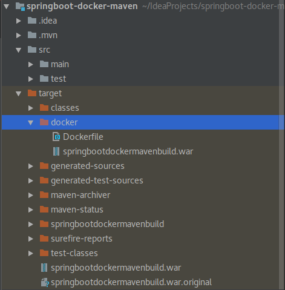
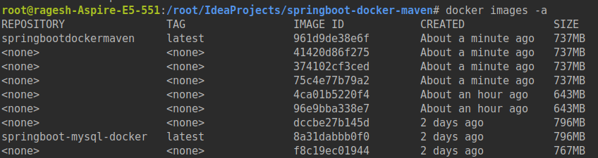

# springboot-docker-maven
This project shows how to configure docker in maven for the springboot application

### Keypoints to remember ###

* pom.xml

```
        <plugin>
				<groupId>com.spotify</groupId>
				<artifactId>docker-maven-plugin</artifactId>
				<configuration>
					<imageName>springbootdockermavenbuild</imageName>
					<baseImage>openjdk:8</baseImage>
					<volumes>
						<volume>/tmp</volume>
					</volumes>
					<runs>
						<run>sh -c 'touch /${project.build.finalName}.war'</run>
					</runs>
					<exposes>
						<expose>8085</expose>
					</exposes>
					<entryPoint>["java", "-Djava.security.egd=file:/dev/./urandom", "-jar", "/${project.build.finalName}.war"]</entryPoint>
					<!-- copy the service jar file from target into the root directory of the image -->
					<resources>
						<resource>
							<targetPath>/</targetPath>
							<directory>${project.build.directory}</directory>
							<include>${project.build.finalName}.war</include>
						</resource>
					</resources>
				</configuration>
		</plugin>

```

* Used spotify docker maven plugin for this application.

* No need to create dockerfile explicitly in the application. This plugin will create dockerfile in the target/docker folder by default.

* Run this command to create the image 
    ```
    mvn clean package docker:build
    
    ```


* The above command will create the dockerfile and jar or war file in the target/docker location

* Run this command to run the docker image

    ```
    docker run -p 8085:8085 -t springbootdockermaven build
    
    ```
    
### Screenshots ###





### Happy Coding ###